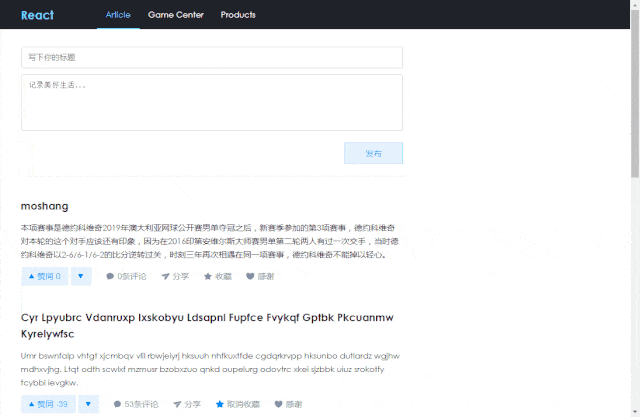
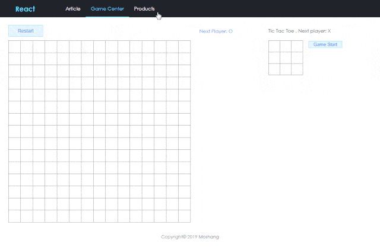

# React 官网示例实现 + 五子棋 + 简单文章发表 demo

github 源码：[https://github.com/moshang-xc/react-demo](https://github.com/moshang-xc/react-demo)

## 模块功能

该项目使用 React + React-router 开发，主要是熟悉 React 的接口和使用，主要包含三个模块的功能

- [类似博客模块](#类似博客模块)
- React 官网[入门教程](https://www.reactjscn.com/tutorial/tutorial.html)示例实现和[五子棋游戏](#五子棋游戏)
- React 官网[React 理念](https://www.reactjscn.com/docs/thinking-in-react.html)示例[实现](#React理念示例)

通过开启代理服务器提供数据 API，代理服务器通过使用[mock-mini-server](https://github.com/moshang-xc/mock-mini-server)，通过配置相应的规则，使用`Mock`生成随机数据，同时可以自定义处理请求，实现一个简易版的服务器，支持数据的更新操作，具体的使用可见[使用文档](https://github.com/moshang-xc/mock-mini-server)和本项目的配置文件`mockhttp.js`

### 运行

```
# 拉取代码
git clone https://github.com/moshang-xc/react-demo
cd react-demo

# 安装依赖
npm install

# 开启代理服务器
npx mock-mini-server

# 运行react项目
npm start
```

### 类似博客模块


该模块主要包含文章的发表，点赞，取消点赞，收藏，感谢，查看评论等功能，只是一些简单的实现，还有很多不足。文章发布后可以与本地服务器进行通信，实时的更新界面数据显示。点赞等数据没有与服务器交互，只是修改了本地缓存的数据源。点击评论可以展开/收缩评论列表，评论数据实时从服务器获取，评论数据每次获取的都是通过`Mock`重新生成的，所以每次的结果都不一样。

### 五子棋游戏


该模块实现了`五子棋`和`井字游戏`两个游戏。

游戏的过程中可以悔棋，可以重新开始游戏，悔棋，点击右侧相应的步数信息 button 即可。`五子棋`游戏只记录了最近 20 步的数据，20 步以前的数据不会记录，故悔棋只可悔 20 步以内的棋。当游戏结束，成功的一方的五个连线棋子会高亮显示。

### React 理念示例



以上所有的数据都是通过本地服务器[mock-mini-server](https://github.com/moshang-xc/mock-mini-server)提供，通过扩展[mock]()实现一些数据交互功能。

`mock-mini-http`配置

```js
module.exports = {
  defaultDataFile: "index.js",
  baseDist: "/src/data",
  port: 8090,
  openBrowser: false,
  /**
   * 中间件，拦截请求之类的操作
   * req: express请求参数， res:express返回参数， next：express传递, server: 当前数据操作的server对象
   * function(req, res, next， server)
   */
  middleWare: {
    // 处理发布文章
    api: "/setArticle",
    callback: function(req, res, next, server) {
      console.log("中间件，劫持请求 /setArticle");
      let data = req.body;
      server
        .loadData("getArticles")
        .then(result => {
          data.ID = result.articles.length + 1;
          data.like = 0;
          data.comment = 0;
          data.thank = false;
          data.collection = false;
          result.articles.unshift(data);
          server.updateData("getArticles", result);
          res.send("ok");
        })
        .catch(err => {
          console.log(err);
          next();
        });
    }
  }
};
```
